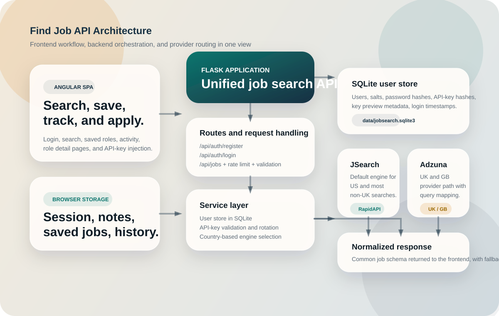
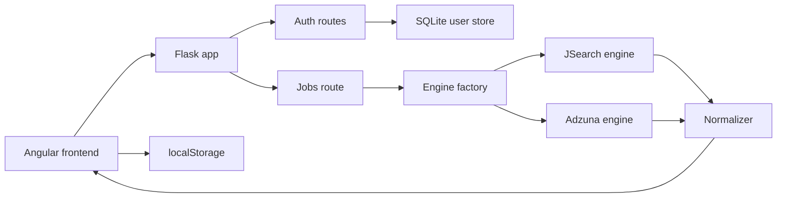
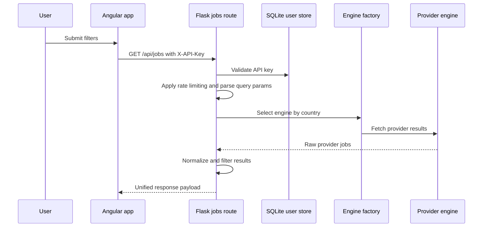

# Find Job API Architecture

  

This document explains how the current system is structured, how requests move through it, and where the most important product and backend responsibilities live.

## System Summary

The application has two major layers:

- an Angular frontend that handles login, search UX, saved roles, notes, and recent activity
- a Flask backend that authenticates requests, selects job providers, normalizes results, and serves Swagger docs

The system is intentionally small enough to understand quickly, but it still demonstrates the boundaries you would expect in a more production-oriented product:

- route-level request handling
- a service layer for users and provider selection
- provider-specific engines
- normalized response shaping
- persistent backend auth data plus frontend productivity state

## High-Level Flow

## Frontend Responsibilities

The frontend is responsible for turning the API contract into a usable workflow.

### Main surfaces

- `frontend/src/app/pages/login/`
  Account creation and sign-in flow
- `frontend/src/app/pages/search/`
  Search filters, results, quick relaunch, and save actions
- `frontend/src/app/pages/saved/`
  Saved roles plus inline notes
- `frontend/src/app/pages/activity/`
  Recent search history with one-click reruns
- `frontend/src/app/pages/job-detail/`
  Detail view for saved or recently fetched roles

### Frontend state boundaries

- `AuthService`
  Stores the signed-in session in `localStorage`
- `api-key.interceptor.ts`
  Injects `X-API-Key` into protected `/api` requests
- `UserDataService`
  Persists saved jobs, notes, and recent searches in `localStorage`
- `auth.guard.ts`
  Redirects unauthenticated users to `/login`

This is a practical split: account and API authorization stay server-backed, while lightweight productivity data stays local to the browser.

## Backend Responsibilities

### Flask app composition

`app.py` creates the Flask application, loads environment variables, registers Swagger, initializes the SQLite user database, registers blueprints, and optionally serves the built Angular app.

### Route layer

- `routes/auth.py`
  Handles registration and login
- `routes/jobs.py`
  Handles API-key auth, rate limiting, query parsing, provider selection, normalization, and fallback
- `routes/health.py`
  Exposes a health endpoint

### Service layer

- `services/user_store.py`
  Owns user creation, password verification, API-key lookup, and DB initialization
- `services/engine_factory.py`
  Routes `uk` and `gb` searches to Adzuna and defaults to JSearch otherwise

### Provider engines

- `services/engines/jsearch.py`
  Builds RapidAPI JSearch requests
- `services/engines/adzuna.py`
  Builds Adzuna requests and maps search filters into provider parameters

### Normalization and utility layer

- `utils/normalizer.py`
  Converts provider-specific job payloads into one shared response shape
- `utils/rate_limiter.py`
  Applies in-memory request limiting by IP
- `utils/sample_jobs.py`
  Supplies development fallback results
- `utils/auth.py`
  Handles salted hashing, API-key generation, and legacy key support

## Authentication and Session Model

The auth model separates backend identity from frontend session usage.

### Registration and login

1. The frontend posts credentials to `/api/auth/register` or `/api/auth/login`.
2. The backend creates or verifies the user in SQLite.
3. A fresh API key is returned to the frontend.
4. The frontend stores the session locally.
5. Future job-search requests automatically include `X-API-Key`.

### Storage behavior

- passwords are stored as salted SHA-256 hashes
- API keys are stored as salted SHA-256 hashes
- only a key prefix and preview string are stored for lookup and display
- login rotates the API key, which is stronger than keeping one long-lived token forever

## Job Search Request Lifecycle

### Query handling responsibilities

The jobs route handles:

- required `query` validation
- country selection
- location, distance, work mode, and type filters
- page parsing
- authentication checks
- rate limiting
- provider fallback behavior

This keeps provider engines focused on provider communication instead of HTTP route concerns.

## Data Boundaries

### Backend persistent data

- SQLite user database at `data/jobsearch.sqlite3`
- user identity, salted password hashes, API-key hashes, timestamps

### Browser-local data

- current session payload
- saved jobs
- notes
- search history

### Provider data

- JSearch for US and default search traffic
- Adzuna for UK and GB traffic

## Deployment Modes

### Development mode

- Angular runs on `localhost:4200`
- Flask runs on `127.0.0.1:5001`
- Angular proxies `/api` requests to Flask

### Production-style local mode

- Angular is built into `frontend/dist/frontend/browser`
- Flask serves the compiled SPA directly

This makes the repo convenient both for day-to-day development and for portfolio demos.

## Current Constraints

- `utils/cache.py` exists but is not currently wired into live provider fetches
- rate limiting is in-memory and resets with process restart
- saved jobs and notes are browser-local rather than account-synced
- RapidAPI credentials are still required at startup because JSearch config is imported eagerly
- test coverage is lighter than the current product surface

## Good Next Steps

- move saved jobs and notes to account-backed persistence
- wire caching into provider requests and surface real cache metadata
- document and add a Gunicorn entry path
- add backend tests around auth, filtering, and fallback behavior
- add frontend tests around routing, state persistence, and API error handling
