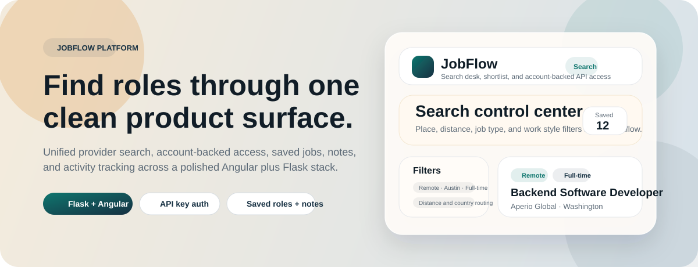
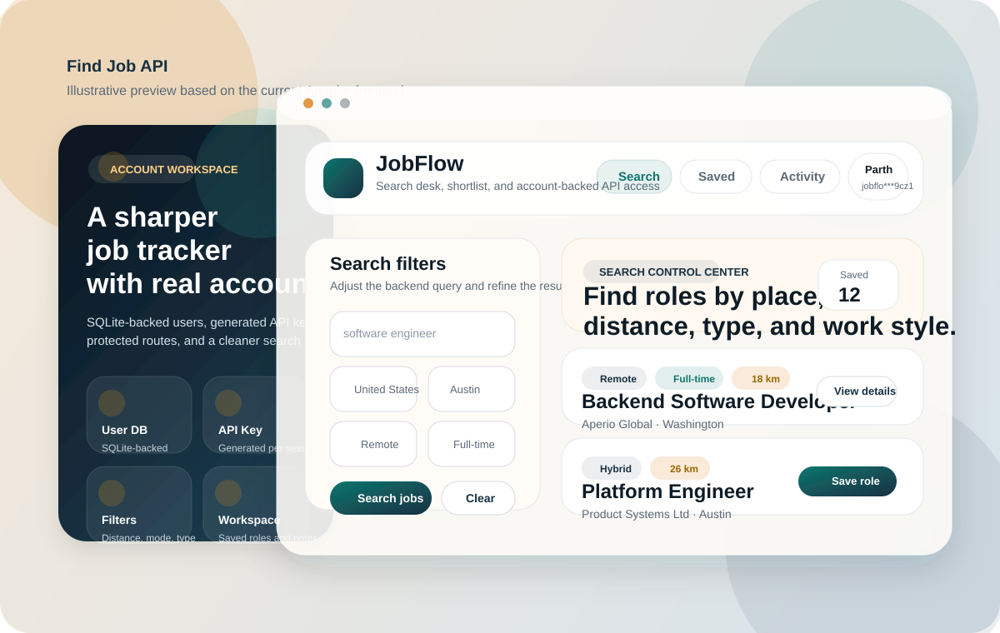
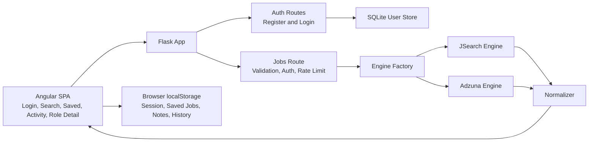
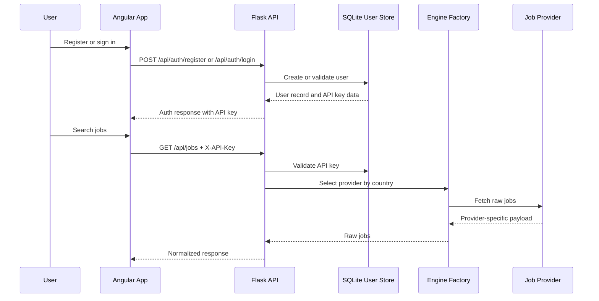

# Find Job API


<p align="center">
  <b>Production-style job discovery platform built with Flask and Angular</b><br/>
  Unified provider search · Account-backed access · Saved jobs, notes, and activity tracking
</p>

<p align="center">
  
</p>

<p align="center">
  <sub>Illustrative README visuals based on the current frontend layout and styling in this repository.</sub>
</p>

<p align="center">
  <a href="#overview"><b>Overview</b></a> ·
  <a href="#preview"><b>Preview</b></a> ·
  <a href="#architecture"><b>Architecture</b></a> ·
  <a href="./ARCHITECTURE.md"><b>Architecture Notes</b></a> ·
  <a href="#local-development"><b>Local Development</b></a> ·
  <a href="#api-overview"><b>API Overview</b></a>
</p>

## Overview

Find Job API is a full-stack job search application designed to feel like a real product, not just a thin wrapper around third-party APIs.

The backend hides provider-specific differences behind one normalized `/api/jobs` contract. The frontend then turns that contract into a usable workflow with account creation, protected pages, saved roles, personal notes, recent search history, and a clean search experience across countries and filters.

Core capabilities:

- multi-provider job search through a single API surface
- account registration and login with issued API keys
- protected Angular routes for authenticated usage
- saved jobs and private notes stored in the browser
- recent-search activity with one-click reruns
- Swagger documentation for direct API exploration
- sample-job fallback when live providers fail during development

## Preview

The current frontend is designed as a warm, workspace-style search desk rather than a generic dashboard. The visual system uses paper-toned gradients, glassy surface cards, deep teal branding, rounded controls, and focused page-level storytelling across the auth, search, saved, and activity views.

<p align="center">
  
</p>

## Why This Project Matters

Most job-search demos stop at "call one API and print cards." This project goes further:

- provider-specific schemas are normalized into one response shape
- authentication is built into the product instead of bolted on
- the frontend is stateful enough to support real workflows, not just one search form
- backend and frontend are wired for both local development and production-style serving
- failure handling is considered, so the app remains usable even when a provider request breaks

That makes the repo a stronger showcase for backend, full-stack, and product-minded engineering work.

## Suggested Walkthrough

1. Register a new account from the Angular app.
2. Search for a role like `software engineer` in `us` or `uk`.
3. Apply filters such as `remote`, `hybrid`, `onsite`, job type, and location.
4. Save a few jobs and attach notes to them.
5. Open the activity page and rerun a previous search.
6. Build the Angular app and let Flask serve the compiled frontend.

## Engineering Challenges

- normalizing heterogeneous provider payloads into one client contract
- mapping filters like work mode and employment type across different APIs
- protecting provider-backed search with user auth and API-key checks
- keeping the frontend useful even when live provider credentials fail or requests error
- balancing simple deployment with a split frontend-backend development experience

## Feature Set

### Search Platform

- normalized `GET /api/jobs` endpoint
- country-based engine routing
- support for `query`, `country`, `location`, `distance`, `page`, `work_mode`, and `type`
- provider fallback to local sample data when live requests fail

### Auth and Access

- `POST /api/auth/register`
- `POST /api/auth/login`
- generated API keys returned to authenticated users
- salted password hashing and salted API-key hashing in SQLite
- route protection in the Angular app

### Product Experience

- account-first login and registration flow
- search page with reusable filter state
- saved jobs with inline notes
- activity page with recent-search history
- detail page for saved or recently viewed roles

### Documentation and Developer Experience

- Swagger UI at `/apidocs`
- clean backend route and service separation
- Angular proxy for local API development
- Flask fallback to serving the built Angular app in one process

## Architecture

### Visual Architecture

<p align="center">
  
</p>

More implementation detail lives in [ARCHITECTURE.md](./ARCHITECTURE.md).

### System Diagram



### Request Flow



### Core Building Blocks

| Layer | Responsibility |
| --- | --- |
| `app.py` | Flask app creation, Swagger setup, blueprint registration, built-frontend serving |
| `routes/auth.py` | Registration and login endpoints, legacy API-key compatibility |
| `routes/jobs.py` | Auth checks, rate limiting, filter parsing, provider fallback, normalized job response |
| `routes/health.py` | Basic health endpoint |
| `services/user_store.py` | SQLite user creation, authentication, API-key lookup |
| `services/engine_factory.py` | Country-to-provider routing |
| `services/engines/*.py` | Provider-specific request building and API calls |
| `utils/normalizer.py` | Converts provider payloads into one client schema |
| `frontend/src/app/core/services/*.ts` | Auth session state, API calls, saved jobs, notes, and search history |

## Technical Choices

### Provider Engines Behind One Contract

The backend chooses a provider by country and returns one normalized result shape to the frontend. This keeps provider-specific request and response logic away from the UI.

### API Keys Are Rotated and Stored Safely

On login, a fresh API key is issued. The server stores only salted hashes plus a searchable prefix and preview string, which is more realistic than keeping raw keys in the database.

### Local-First Productivity State

Saved jobs, notes, search history, and the user session live in browser storage. That keeps the frontend fast and simple while still demonstrating meaningful product behavior.

### Flask Can Serve the Built SPA

In development, Angular runs on its own dev server and proxies API traffic to Flask. After a production build, Flask can serve the compiled frontend from `frontend/dist/frontend/browser`, which makes local production-style demos straightforward.

### Graceful Fallback for Provider Failures

If a live provider request fails, the jobs route falls back to sample data so the UI remains usable during development. One current limitation is that RapidAPI environment variables are still required at backend startup because the JSearch configuration is loaded during import time.

## Project Structure

```text
find-job-api/
├── ARCHITECTURE.md                  Deeper system notes and request-flow explanations
├── app.py                           Flask entry point and frontend serving
├── assets/
│   ├── jobflow-hero.svg             README hero banner
│   ├── jobflow-preview.svg          README product preview illustration
│   └── jobflow-architecture.svg     README architecture visual
├── config.py                        RapidAPI configuration loading
├── requirements.txt                 Backend dependencies
├── routes/
│   ├── auth.py                      Register and login endpoints
│   ├── health.py                    Health check routes
│   └── jobs.py                      Search endpoint, filtering, auth, fallback
├── services/
│   ├── engine_factory.py            Country-to-engine selection
│   ├── user_store.py                SQLite user store and auth helpers
│   └── engines/
│       ├── base.py                  Engine contract
│       ├── jsearch.py               RapidAPI JSearch integration
│       └── adzuna.py                Adzuna integration
├── utils/
│   ├── auth.py                      API-key and password helpers
│   ├── cache.py                     In-memory cache helpers
│   ├── normalizer.py                Provider response normalization
│   ├── rate_limiter.py              Per-IP rate limiting
│   └── sample_jobs.py               Local sample fallback data
├── data/
│   └── jobsearch.sqlite3            SQLite user database at runtime
└── frontend/
    ├── package.json                 Angular scripts and dependencies
    ├── proxy.conf.json              Dev proxy to Flask
    └── src/app/                     Angular pages, services, models, and guards
```

## Stack

- Python
- Flask
- Flasgger / Swagger UI
- Requests
- SQLite
- Angular 21
- RxJS
- TypeScript
- Browser `localStorage`
- RapidAPI JSearch
- Adzuna Jobs API

## Local Development

### Requirements

- Python 3.11 or newer recommended
- Node.js LTS recommended
- npm

Angular CLI 21 is best used with an LTS Node release.

### Install

Clone the repository:

```bash
git clone https://github.com/parthrohit22/find-job-api.git
cd find-job-api
```

Set up the backend:

```bash
python -m venv venv
source venv/bin/activate
pip install -r requirements.txt
```

Set up the frontend:

```bash
cd frontend
npm install
cd ..
```

### Environment Variables

Create a root `.env` file:

```env
RAPIDAPI_KEY=your_rapidapi_key
RAPIDAPI_HOST=jsearch.p.rapidapi.com
ADZUNA_APP_ID=your_adzuna_app_id
ADZUNA_APP_KEY=your_adzuna_app_key
APP_PORT=5001
USER_DB_PATH=data/jobsearch.sqlite3
```

| Variable | Required | Purpose |
| --- | --- | --- |
| `RAPIDAPI_KEY` | Yes | Required for backend startup and JSearch requests |
| `RAPIDAPI_HOST` | Yes | RapidAPI host, usually `jsearch.p.rapidapi.com` |
| `ADZUNA_APP_ID` | For live UK or GB search | Adzuna app identifier |
| `ADZUNA_APP_KEY` | For live UK or GB search | Adzuna app key |
| `APP_PORT` | No | Flask port, default `5001` |
| `USER_DB_PATH` | No | SQLite database path |

Never commit real credentials.

### Run in Development

Start Flask in one terminal:

```bash
source venv/bin/activate
python app.py
```

Start Angular in another:

```bash
cd frontend
npm start
```

Open:

- Frontend: `http://localhost:4200`
- Backend API: `http://127.0.0.1:5001`
- Swagger UI: `http://127.0.0.1:5001/apidocs`

Angular proxies `/api` requests to Flask through `frontend/proxy.conf.json`.

### Production-Style Local Run

Build the frontend:

```bash
cd frontend
npm run build
cd ..
```

Then start Flask:

```bash
source venv/bin/activate
python app.py
```

If the build exists, Flask serves the compiled SPA directly.

## Verification

Useful checks for this repo:

```bash
curl http://127.0.0.1:5001/api/health
cd frontend && npm run build
```

Manual smoke test:

1. Register a user.
2. Sign in and confirm you receive an API key.
3. Run a search in `us`.
4. Save a result and add a note.
5. Open the activity page and rerun the search.

## API Overview

### Auth Endpoints

| Method | Route | Description |
| --- | --- | --- |
| `POST` | `/api/auth/register` | Create a user and issue an API key |
| `POST` | `/api/auth/login` | Authenticate a user and rotate the API key |

### Core Endpoints

| Method | Route | Description |
| --- | --- | --- |
| `GET` | `/api/jobs` | Search jobs with normalized results |
| `GET` | `/api/health` | Basic health check |
| `GET` | `/apidocs` | Interactive Swagger UI |

### `GET /api/jobs`

Required header:

```http
X-API-Key: your-api-key
```

Supported query parameters:

| Parameter | Required | Notes |
| --- | --- | --- |
| `query` | Yes | Search keyword or role title |
| `country` | No | Defaults to `us`; `uk` and `gb` use Adzuna |
| `location` | No | City or region keyword |
| `distance` | No | Radius in kilometers |
| `page` | No | Defaults to `1` |
| `work_mode` | No | `remote`, `hybrid`, or `onsite` |
| `type` | No | `FULLTIME`, `PARTTIME`, `CONTRACT`, `INTERNSHIP` |

Example request:

```bash
curl "http://127.0.0.1:5001/api/jobs?query=backend%20engineer&country=us&location=Austin&work_mode=remote&type=FULLTIME" \
  -H "X-API-Key: your-api-key"
```

Example response:

```json
{
  "cached": false,
  "query": "backend engineer",
  "country": "us",
  "filters": {
    "location": "Austin",
    "distance": null,
    "work_mode": "remote",
    "type": "FULLTIME"
  },
  "page": 1,
  "count": 10,
  "results": [
    {
      "id": "XacHlAyDYl96t7ASAAAAAA==",
      "title": "Backend Software Developer",
      "company": "Aperio Global",
      "location": "Washington",
      "remote": false,
      "work_mode": "remote",
      "employment_type": "Full-time",
      "apply_link": "https://www.example.com/apply",
      "apply_source": "Company Site",
      "apply_type": "direct"
    }
  ],
  "source": "provider",
  "warning": null
}
```

## Tradeoffs

- saved jobs, notes, and search history are browser-local, not server-synced
- rate limiting is in-memory and process-local
- the cache helper exists in the repo but is not yet wired into provider fetches
- RapidAPI configuration is still required at startup even though runtime fallback exists
- automated test coverage is still lighter than the product surface area

## Roadmap Ideas

- server-side persistence for saved jobs and activity
- real provider caching with accurate `cached` response metadata
- more provider integrations beyond JSearch and Adzuna
- a documented Gunicorn deployment flow
- broader backend and frontend test coverage

## Repo Quality Goals

This repository is intentionally structured to present well in reviews:

- backend layers are separated cleanly by route, service, engine, and utility
- API normalization is visible in both code organization and documentation
- product behavior is explained, not just listed
- setup instructions map directly to the actual codebase

## License

No license file is currently included in this repository.
